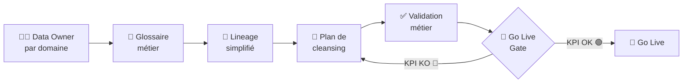

# Data Governance en projet SI : pourquoi vos données sabotent votre Go Live

## Le jour où le projet s'est arrêté net

Il est 9h du matin. Salle de projet, open space bruyant, post-its sur tous les murs. Le chef de projet IT présente les résultats du premier run d'extraction vers le nouvel ERP.

40% des données sources n'existent que dans des fichiers Excel. Sur les serveurs locaux. De collaborateurs qui ont parfois quitté l'entreprise.

Silence dans la salle.

Ce n'est pas une panne. Ce n'est pas un bug. C'est l'entreprise elle-même qui vient de se regarder dans un miroir pour la première fois.

J'ai vécu cette scène plusieurs fois. Avec des noms différents, des industries différentes, des montants différents. Mais le même silence. La même question dans les yeux du sponsor : _"Comment on n'a pas vu ça avant ?"_

La réponse est simple : **vous n'avez jamais nommé le problème data**. Vous l'avez traité comme un sous-chantier technique. Comme quelque chose que "l'IT va gérer".

C'est là que tout s'effondre.

---

## Le mythe de la "migration technique"

Posons les choses clairement : **une migration de données n'est pas un projet IT. C'est un projet métier avec un outillage IT.**

La confusion vient de la visibilité. Les développeurs, les ETL, les connecteurs — tout ça, ça se voit. Le métier, lui, est invisible dans le projet : il répond aux emails "quand il a le temps", valide les spécifications en diagonale, et apparaît au moment du recettage pour découvrir que le système ne ressemble pas à ce qu'il attendait.

J'ai un exemple qui me suit depuis des années. Un projet PLM dans une entreprise industrielle.

**45 000 références à migrer.** L'équipe IT fait un travail remarquable : extraction, transformation, normalisation, chargement. Tout propre, tout documenté.

Sauf qu'ils n'ont jamais posé une seule question au Bureau d'Études.

Résultat à la livraison :

- **12 000 références obsolètes migrées** — des pièces arrêtées depuis 5 à 10 ans
- **3 000 références critiques manquantes** — des composants actifs qui existaient uniquement dans les cahiers de l'atelier
- **Go Live décalé de 4 mois**

**J'appelle ça le syndrome du miroir propre dans la mauvaise pièce.** Votre migration est impeccable. Mais vous avez migré la mauvaise réalité.

---

## Les 5 symptômes d'une data governance absente

**Symptôme 1 — Personne ne sait qui est propriétaire d'une donnée.**
Vous posez la question : "Qui valide la liste des fournisseurs actifs ?" Réponse : _"C'est les achats... ou la compta... enfin, ça dépend."_ Dès qu'une donnée a plusieurs propriétaires, elle n'en a aucun.

**Symptôme 2 — Le glossaire n'existe pas.**
"Client", "article", "référence", "produit fini" — chaque département a sa propre définition. La migration transporte les mots, pas le sens.

**Symptôme 3 — Le système source est "le vrai système"... mais personne ne s'y fie.**
Quand les équipes maintiennent des fichiers Excel parallèles "parce que le système n'est jamais à jour", c'est un aveu.

**Symptôme 4 — Le plan de cleansing est une ligne dans le planning.**
"Nettoyage données : 2 semaines — équipe IT." Qui nettoie quoi ? Sur quels critères ? Avec quelle validation métier ?

**Symptôme 5 — La recette data est faite par l'IT.**
Un développeur peut vérifier le format. Il ne peut pas vérifier que la référence AR-4521-B correspond bien à un composant actif. Seul le métier le sait.

---

## Le framework pragmatique

Quatre piliers. Dans l'ordre.

### Flux Data Governance

### Pilier 1 — Data Owner par domaine : un nom, pas une fonction

Un Data Owner, c'est **une personne**. Un prénom. Quelqu'un qui peut dire oui ou non sur la validité d'une donnée dans son domaine.

| Domaine fonctionnel  | Data Owner (nom + rôle) | Périmètre                             | Volume estimé | Délai cleansing |
| -------------------- | ----------------------- | ------------------------------------- | ------------- | --------------- |
| Référentiel Articles | Responsable BE          | Nomenclatures, fiches techniques      | 45 000 réf.   | 8 semaines      |
| Tiers / Fournisseurs | Responsable Achats      | Données fournisseurs, contacts        | 3 200 tiers   | 4 semaines      |
| Clients / CRM        | Responsable ADV         | Fiches clients, conditions tarifaires | 8 500 clients | 5 semaines      |
| Stock / Inventaire   | Responsable Logistique  | Niveaux stock, emplacements           | 12 000 UGS    | 3 semaines      |
| Ressources Humaines  | Responsable RH          | Structures org., coûts standards      | 450 salariés  | 2 semaines      |

### Pilier 2 — Glossaire métier

Trois colonnes : **terme**, **définition métier**, **système(s) porteur(s)**. Validé par les Data Owners. Pas par l'IT.

### Pilier 3 — Lineage simplifié

| Champ cible | Source actuelle | Système source | Règle de transformation | Propriétaire |
| ----------- | --------------- | -------------- | ----------------------- | ------------ |

### Pilier 4 — Plan de cleansing avec jalons mesurables

Un co-livrable IT/métier avec des jalons binaires. Si le jalon n'est pas atteint, on ne passe pas à l'étape suivante.

---

> **À mi-chemin, une question directe :**
> Si vous ne pouvez pas nommer le Data Owner de vos articles en 5 secondes — vous avez un problème. Pas dans 6 mois. Maintenant.
> **[→ Réservez une session de cadrage data 90 min](https://www.pragmaltar.com/contact)** — pro bono, sans engagement.

---

## Les KPI qui sauvent un Go Live

| KPI                | Définition                       | 🟢 GO | 🟡 WATCH | 🔴 STOP |
| ------------------ | -------------------------------- | ----- | -------- | ------- |
| Taux de complétude | % champs obligatoires renseignés | ≥ 95% | 85–94%   | < 85%   |
| Taux de matching   | Réfs source trouvées dans cible  | ≥ 98% | 92–97%   | < 92%   |
| Taux de doublons   | Enregistrements dupliqués        | < 1%  | 1–3%     | > 3%    |
| Delta volumétrie   | Écart volume source/cible        | < 2%  | 2–5%     | > 5%    |
| Validation métier  | Lots validés par Data Owner      | 100%  | > 80%    | ≤ 80%   |

**Règle : un seul KPI en rouge bloque le Go Live. Sans dérogation.**

---

## Test rapide — Votre data governance en 3 questions

> **Question 1 :** Pouvez-vous citer le prénom du Data Owner pour chacun de vos 3 principaux domaines de données ?
>
> **Question 2 :** Quel est votre taux de complétude actuel sur les données critiques à migrer ?
>
> **Question 3 :** Votre équipe IT et votre équipe métier ont-elles la même définition du terme "article actif" ?
>
> **Score :** 3 OUI → gouvernance sur les bons rails. 1-2 → angles morts. 0 → risque Go Live majeur.

---

## FAQ

**Comment démarrer sans outil MDM ?**
Un tableur partagé avec 5 colonnes de lineage, un glossaire sur SharePoint, et des Data Owners formalisés suffisent pour 80% des projets. L'outil vient après la gouvernance, jamais avant.

**Le Data Owner doit-il être disponible à 100% ?**
Non. Mais il doit être disponible aux moments critiques : validation des règles de mapping, recette UAT, signature gate Go Live. Environ 2-3 jours cumulés sur 3 mois. Non-négociable.

**Nos données sources sont catastrophiques. On tient les délais ?**
Oui, à condition de décider maintenant ce que vous migrez et ce que vous ne migrez pas. Une migration partielle maîtrisée vaut mieux qu'une migration totale chaotique.

---

## Conclusion

La data governance n'est pas un sujet technique de fond de backlog. C'est le premier levier de redressement d'un projet SI qui dérape. Nommer les responsables. Aligner les définitions. Mesurer avant de migrer.

**Téléchargez la checklist Data Owner + plan de cleansing** pour vos prochains audits projet.

Et si vos données sont le vrai sujet de votre projet — [parlons-en](https://www.pragmaltar.com/contact). Le bon moment, c'est maintenant.

---

_Tarik Poulain est fondateur de Pragmaltar et intervient depuis 20 ans en redressement de projets IT complexes — ERP, PLM, ITSM — dans l'aérospatial, l'industrie, l'agroalimentaire et le transport urbain._
